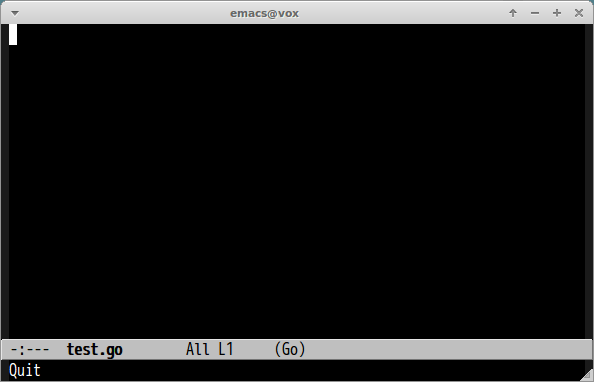

# go-impl.el [![travis badge][travis-badge]][travis-link] [![melpa badge][melpa-badge]][melpa-link] [![melpa stable badge][melpa-stable-badge]][melpa-stable-link]

[impl](https://github.com/josharian/impl) for Emacs

## ScreenCast




## Requirements

- [impl](https://github.com/josharian/impl)
- [godoc](https://godoc.org/golang.org/x/tools/cmd/godoc)

```
% go get -u github.com/josharian/impl
% go get -u golang.org/x/tools/cmd/godoc
```


## Installation

`go-impl` is available on [MELPA](https://melpa.org/) and [MELPA stable](https://stable.melpa.org/)

You can install `go-impl` with the following command.

<kbd>M-x package-install [RET] go-impl [RET]</kbd>


## Command

#### `M-x go-impl` `(go-impl receiver interface)`

Insert snippet by `impl receiver interface`.


## Customization

#### `go-impl-aliases-alist`

Association list of aliases of interface names. If interface name is matched
with alias, then `go-impl` replaces alias with real interface name. Example is as below.

```lisp
(custom-set-variables
 '(go-impl-aliases-alist '(("hh" . "http.Handler")
                           ("irw" . "io.ReadWriter"))))
```


#### `go-impl-enter-function`

If this value is non-nil, go-impl enters into first function after inserting stubs.

[travis-badge]: https://travis-ci.org/syohex/emacs-go-impl.svg
[travis-link]: https://travis-ci.org/syohex/emacs-go-impl
[melpa-link]: https://melpa.org/#/go-impl
[melpa-stable-link]: https://stable.melpa.org/#/go-impl
[melpa-badge]: https://melpa.org/packages/go-impl-badge.svg
[melpa-stable-badge]: https://stable.melpa.org/packages/go-impl-badge.svg
